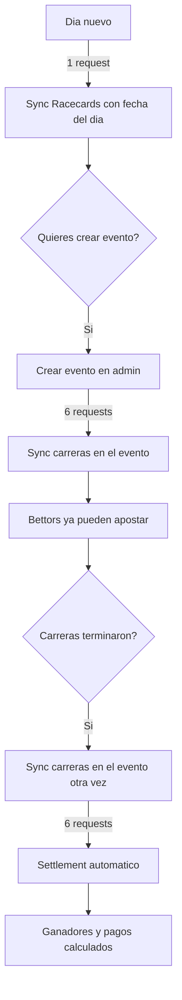

# Guia Operativa de Sync API

## Los 5 botones y que hace cada uno

### Dashboard Admin (3 botones globales + fecha)

```
[Fecha: 14/03/2026]  [Sync Racecards]  [Sync Resultados]  [Sync Todo]
```

**1. Sync Racecards** -- Trae la LISTA de carreras de la fecha seleccionada

- Llama a `GET /racecards?date=FECHA`
- Requests: **1 siempre** (sin importar cuantas carreras haya)
- Que trae: metadata de TODAS las carreras de TODOS los hipodromos del dia (id, curso, distancia, hora, estado finished/canceled)
- Que NO trae: detalle de runners (caballos, jockeys, posiciones)
- Cuando usar: cuando quieres descubrir que carreras hay un dia nuevo

**2. Sync Resultados** -- Trae detalles de carreras terminadas, FILTRADO

- Llama a `GET /results?date=FECHA` (1 request)
- Luego, por cada carrera finished que pertenezca a un hipodromo con evento activo: `GET /race/:id` (1 request cada una, con 7s de delay)
- Requests: **1 + N** donde N = carreras finished de hipodromos con eventos activos
- El filtro: si solo tienes un evento abierto en Aqueduct (8 carreras), solo descarga esas 8, ignora las otras ~89

**3. Sync Todo** -- Ejecuta Racecards + Resultados en secuencia

- Es literalmente: Sync Racecards primero, luego Sync Resultados
- Requests: **1 + 1 + N** (un racecard + un results + N detalles filtrados)

### Vista de Evento Admin (1 boton por evento)

**4. Sync carreras** (boton en la pagina del evento)

- NO llama a `/racecards` ni a `/results`
- Llama directamente a `GET /race/:id` solo para las 6 carreras del evento
- Requests: **exactamente 6** (una por game_event_race)
- Es la opcion mas eficiente cuando ya sabes que carreras necesitas
- Trae: runners, posiciones, non_runners, jockeys, trainers -- todo lo necesario para settlement

---

## Escenarios hipoteticos

### Escenario 1: Dia nuevo, quieres crear un evento

Supongamos: 15 de marzo, 12 hipodromos con ~100 carreras totales, quieres crear un evento para Aqueduct.

| Paso | Accion | Requests | Que obtienes |
|------|--------|----------|-------------|
| 1 | Cambiar fecha a 15/03, click Sync Racecards | 1 | Las 100 carreras aparecen en la DB (metadata). Ahora puedes crear un evento en Aqueduct |
| 2 | Crear evento "Polla 15 de Marzo" en Aqueduct | 0 | El sistema asigna las ultimas 6 carreras de Aqueduct al evento |
| 3 | Click "Sync carreras" en la pagina del evento | 6 | Los runners de esas 6 carreras se descargan. Los bettors ya pueden ver caballos y apostar |
| **Total** | | **7** | |

### Escenario 2: Las carreras terminaron, quieres resultados

Supongamos: evento "Polla 13 de Marzo", 6 carreras de Aqueduct, todas ya corrieron.

**Opcion A -- Sync por evento (recomendada)**

| Paso | Accion | Requests | Que obtienes |
|------|--------|----------|-------------|
| 1 | Ir a admin/eventos/Polla 13, click "Sync carreras" | 6 | Posiciones de runners, settlement automatico, scores |
| **Total** | | **6** | |

**Opcion B -- Sync Resultados global**

| Paso | Accion | Requests | Que obtienes |
|------|--------|----------|-------------|
| 1 | Cambiar fecha a 13/03, click Sync Resultados | 1 + 8 = 9 | Lo mismo, pero tambien descarga las 2 carreras de Aqueduct que NO son del evento |
| **Total** | | **9** | |

### Escenario 3: Multiples eventos activos

Supongamos: 2 eventos abiertos -- Aqueduct (8 carreras) + Gulfstream (10 carreras). Total de carreras del dia: 100.

| Accion | Sin filtro (antes) | Con filtro (ahora) | Por evento |
|--------|-------------------|-------------------|------------|
| Sync Resultados | 1 + 100 = **101** | 1 + 18 = **19** | 6 + 6 = **12** |

### Escenario 4: Situacion real (ejemplo)

Polla 13 de Marzo (Aqueduct, 6 carreras en el evento, 8 totales del hipodromo). Las carreras ya corrieron.

| Opcion | Requests | Tiempo estimado |
|--------|----------|-----------------|
| "Sync carreras" en el evento | 6 | ~42 segundos |
| Sync Resultados fecha 13/03 | 9 | ~63 segundos |
| Sync Todo fecha 13/03 | 10 | ~70 segundos |

---

## Flujo recomendado dia a dia



**Orden recomendado:**

1. **Sync Racecards** (1 req) -- descubrir carreras del dia
2. **Crear evento** -- seleccionar hipodromo y carreras
3. **Sync carreras del evento** (6 req) -- traer runners para que bettors apuesten
4. Esperar a que corran las carreras
5. **Sync carreras del evento** (6 req) -- traer resultados y disparar settlement
6. Total de un dia completo: **13 requests**

Los botones globales (Sync Resultados, Sync Todo) estan disponibles como alternativa o para situaciones donde necesitas actualizar varios eventos a la vez. Pero para el uso normal, "Sync carreras" por evento es lo optimo.
