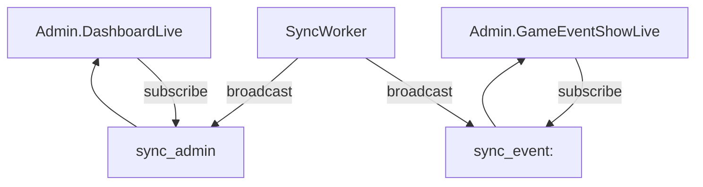

## Objetivo
- Que el dashboard `/admin` ([`lib/bet_place_web/live/admin/dashboard_live.ex`](lib/bet_place_web/live/admin/dashboard_live.ex)) se refresque automáticamente cuando **termine cualquier sync manual**.

## Enfoque
### 1) Emitir eventos PubSub al finalizar syncs manuales
- En [`lib/bet_place/api/sync_worker.ex`](lib/bet_place/api/sync_worker.ex):
  - Mantener el broadcast existente de `sync_event:<game_event_id>`.
  - Añadir **un broadcast global adicional** para dashboards admin, por ejemplo topic `"sync_admin"`, con payload uniforme:
    - `{:sync_completed, %{kind: :event | :racecards | :results, target: game_event_id | date, result: result}}`
  - Para syncs manuales por fecha (`sync_now/2`): en cada `handle_cast({:sync, kind, date}, ...)` (y/o en `:all`), capturar `result = SyncService.sync_*` y emitir `sync_admin`.

### 2) Suscribirse y refrescar `/admin`
- En [`lib/bet_place_web/live/admin/dashboard_live.ex`](lib/bet_place_web/live/admin/dashboard_live.ex):
  - En `mount/3`, si `connected?(socket)` → `Phoenix.PubSub.subscribe(BetPlace.PubSub, "sync_admin")`.
  - Implementar `handle_info({:sync_completed, payload}, socket)`:
    - Recalcular `stats = load_stats()`.
    - Recalcular `api_usage = %{today: ApiSyncLog.requests_today(), month: ApiSyncLog.requests_this_month()}`.
    - Asignar ambos a socket.
    - Mostrar flash de éxito/advertencia según `payload.result` (ej. `{:ok, _}` vs `{:error, _}` vs `:no_change`).

### 3) Mantener compatibilidad con `Admin.GameEventShowLive`
- `Admin.GameEventShowLive` seguirá usando `sync_event:<id>` para refrescar el evento.
- La emisión a `sync_admin` permite que **el dashboard** también se refresque cuando el admin hace sync desde la vista del evento.

## Validación
- `mix compile --warnings-as-errors`
- `mix test`
- Probar manualmente:
  - En `/admin`, ejecutar `Sync Racecards`, `Sync Resultados`, `Sync Todo` y verificar que al terminar se actualicen los contadores y el bloque “Uso de API” sin recargar.
  - En `/admin/eventos/:id`, ejecutar “Sync carreras” y verificar que el evento se refresca y `/admin` se refresca también.

