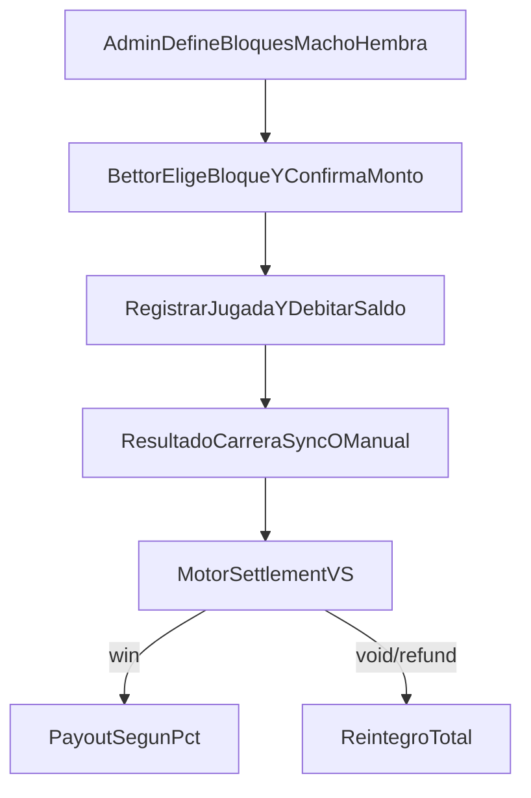

# [dev-017] VS grupos y liquidación

## Objetivo

Implementar el juego VS con bloques **Macho** y **Hembra** definidos por la casa (no por sexo biológico del caballo), apuesta por bloque, confirmación de apuesta, liquidación por reglas de pizarra/retiros y payout configurable por carrera, con soporte de confirmación automática por sync y override manual admin.

## Decisiones cerradas

- Rama objetivo: `dev-017-vs-grupos-y-liquidacion`.
- Confirmación de carrera: **mixto** (auto por sync + opción manual admin de override).
- Macho/Hembra: son **etiquetas de bloque de mercado** (favorito/outsider), definidas por la casa/sistema.

## Diseño funcional propuesto

1. Renombrar semántica de lados:
  - `:a` => bloque `macho`
  - `:b` => bloque `hembra`
   (manteniendo compatibilidad DB, cambiando labels/validaciones de negocio).
2. Apuesta bettor:
  - Selección por radio/tilde de bloque Macho/Hembra.
  - Campo monto.
  - Modal confirmación: “Desea apostar <bloque> por monto <X>”.
3. Reglas settlement VS:
  - Gana el bloque con **mejor llegada** entre sus representantes.
  - Válido solo si al menos un representante de alguno de los bloques está en top 5.
  - Si ambos bloques quedan 6to+ (sin top 5): **refund total**.
  - Caso 1 vs 1 y uno retirado: **void + refund**.
  - Caso bloques con múltiples caballos y retiro parcial: **continúa** con restantes (sin reemplazo).
4. Payout por carrera:
  - Configurable en admin al confirmar carrera/matchup.
  - Default sugerido: 80% (paga 180 por apuesta 100).
  - El sistema debe permitir cualquier porcentaje configurable.

## Cambios de datos

- Migración para `hvh_matchups`:
  - agregar `payout_pct` (`decimal`, precision 5, scale 2, default `80.00`).
  - agregar campos de auditoría de confirmación manual (ej. `settled_by_user_id`, `settled_at`, `settlement_source`).
- Validaciones de consistencia en schema/contexto:
  - `payout_pct > 0`.
  - mínimo 1 runner por bloque.

## Cambios backend

- En `lib/bet_place/betting.ex`:
  - usar `matchup.payout_pct` al calcular `potential_payout` de VS.
  - conservar descuento inmediato de saldo al registrar jugada.
- En `lib/bet_place/betting/settlement.ex`:
  - ajustar reglas para retiro parcial en bloques múltiples (no void global por cualquier non-runner).
  - mantener void en 1 vs 1 con retiro de uno.
  - permitir resolver por sync y por confirmación manual admin reutilizando mismo motor.
- En `lib/bet_place/api/sync_service.ex`:
  - conservar trigger automático post-sync hacia settlement VS.

## Cambios web

- Admin creación matchup:
  - `lib/bet_place_web/live/admin/hvh_matchup_new_live.ex`
  - Cambiar labels a Macho/Hembra y UX de bloques claros.
- Admin confirmación/override:
  - `lib/bet_place_web/live/admin/game_event_show_live.ex`
  - Agregar acción/modal para confirmar VS por carrera con selector/edición de payout `%`.
- Bettor apuesta:
  - `lib/bet_place_web/live/bettor/game_event_show_live.ex`
  - Reemplazar A/B por Macho/Hembra, agregar modal de confirmación antes de `place_hvh_bet`.

## Flujo operativo

## Validación

- Tests de contexto settlement VS:
  - top 5 válido,
  - ambos bloques fuera top 5 => refund,
  - 1v1 con retiro => void/refund,
  - múltiple con retiro parcial => continúa.
- Tests LiveView:
  - modal confirmación bettor,
  - confirmación manual admin con `%` editable.
- Ejecutar `mix precommit` al cierre.
