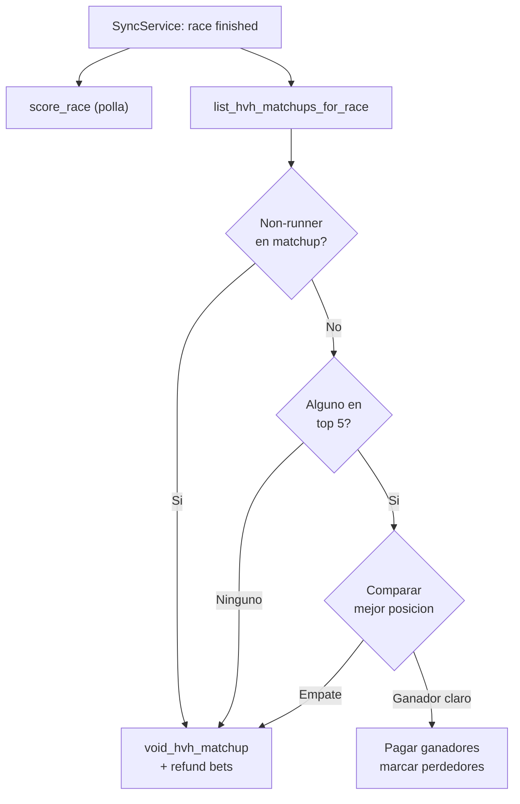

# Liquidacion Horse vs Horse

## Estado actual

La creacion de matchups (admin), apuestas (bettor) y visualizacion (LiveViews) ya existen. Lo que falta es la **liquidacion**: resolver matchups, pagar ganadores, manejar void/refund.

## Reglas de negocio (de CONTEXT.md)

- El lado cuyo caballo tenga la mejor posicion (mas baja) gana
- Si hay N caballos por lado, se toma la mejor posicion de cada lado
- El juego es valido solo si al menos un caballo de cualquier lado termina en top 5
- Si ninguno termina en top 5 -> matchup void -> refund total
- Si un caballo del matchup es non-runner -> matchup void -> refund total
- Payout = `amount x prize_multiplier` (default 1.80x)
- Empate en posicion -> matchup void -> refund

## Cambios a implementar

### 1. Settlement HvH en `settlement.ex`

En [lib/bet_place/betting/settlement.ex](lib/bet_place/betting/settlement.ex), agregar:

```elixir
def resolve_hvh_matchup(matchup_id)
```

Logica:

1. Cargar matchup con sides y runners (con `position`)
2. Si algun runner del matchup es `non_runner` -> void matchup -> refund bets
3. Obtener mejor posicion de side A y side B (solo posiciones 1-5)
4. Si ninguno tiene posicion en top 5 -> void
5. Si empate -> void
6. Si side A tiene mejor posicion -> `result_side: :side_a`
7. Pagar ganadores y marcar perdedores

```elixir
def void_hvh_matchup(matchup_id, reason)
```

Refund todas las bets pendientes del matchup via `Ecto.Multi`.

### 2. Integracion con SyncService

En [lib/bet_place/api/sync_service.ex](lib/bet_place/api/sync_service.ex), dentro de `post_race_sync/1`:

- Despues del bloque de scoring polla (`if race.finished`), agregar resolucion de matchups HvH:

```elixir
if race.finished do
  # ... scoring polla existente ...
  
  # Resolver matchups HvH vinculados a esta carrera
  Betting.list_hvh_matchups_for_race(race.id)
  |> Enum.filter(&(&1.status == :open))
  |> Enum.each(&Settlement.resolve_hvh_matchup(&1.id))
end
```

- En el bloque de non-runners, tambien void matchups con ese runner:

```elixir
Settlement.void_hvh_for_non_runner(race.id, runner.id)
```

- En cancelacion, void todos los matchups de esa carrera.

### 3. Funciones de consulta en Betting context

En [lib/bet_place/betting.ex](lib/bet_place/betting.ex), agregar:

- `list_hvh_matchups_for_race(race_id)` — matchups de una carrera (para resolver desde sync)
- `close_matchups_for_event(game_event_id)` — cerrar matchups cuando cierra el evento

### 4. Validacion min_stake

En `place_hvh_bet/4` de [lib/bet_place/betting.ex](lib/bet_place/betting.ex), agregar un step al `Ecto.Multi`:

```elixir
|> Ecto.Multi.run(:check_min_stake, fn _repo, _ ->
  min = matchup.game_event.game_config.min_stake || Decimal.new("0")
  if Decimal.compare(amount, min) != :lt,
    do: {:ok, amount},
    else: {:error, :below_min_stake}
end)
```

### 5. Cierre automatico de matchups

En [lib/bet_place/betting/settlement.ex](lib/bet_place/betting/settlement.ex) o desde el evento:

Cuando un game_event pasa a `:closed` (betting_closes_at), los matchups abiertos tambien deben cerrarse. Verificar si esto ya se maneja; si no, agregar `close_open_matchups/1` llamado desde el mismo punto que cierra el evento.

### 6. Cancelacion HvH en handle_canceled_race

En `handle_canceled_race/1`, agregar void de matchups HvH de esa carrera (actualmente solo maneja polla).

---

## Flujo de resolucion




## Archivos a modificar

- [lib/bet_place/betting/settlement.ex](lib/bet_place/betting/settlement.ex) — funciones `resolve_hvh_matchup/1`, `void_hvh_matchup/2`, `void_hvh_for_non_runner/2`
- [lib/bet_place/betting.ex](lib/bet_place/betting.ex) — `list_hvh_matchups_for_race/1`, `close_matchups_for_event/1`, validacion min_stake
- [lib/bet_place/api/sync_service.ex](lib/bet_place/api/sync_service.ex) — integrar resolucion HvH en `post_race_sync/1`

