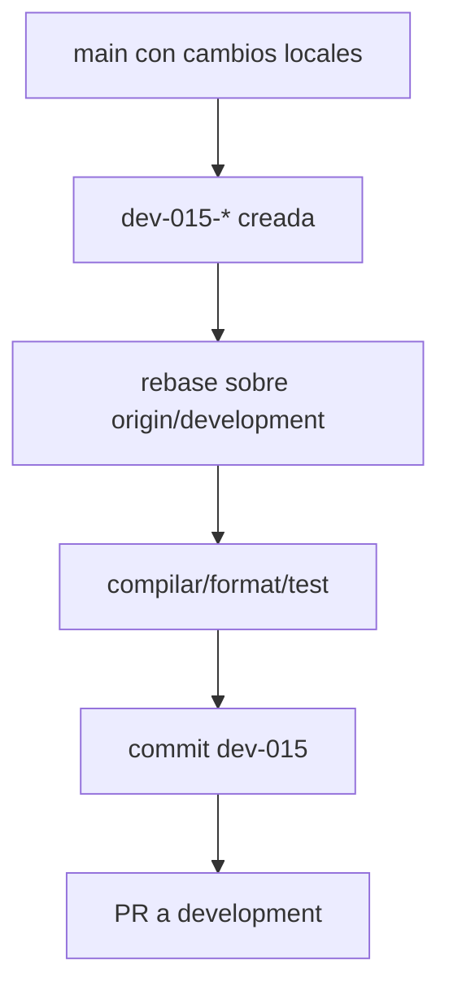

## Objetivo
- Integrar los cambios locales actuales (5 archivos) en una rama feature y dejarlos listos para PR a `development`, asegurando compilación/tests y evitando commits directos a `main`.

## Estado actual detectado
- Rama actual: `main`.
- Cambios locales sin commit:
  - `lib/bet_place/api/sync_worker.ex`
  - `lib/bet_place_web/live/admin/game_event_show_live.ex`
  - `lib/bet_place/betting.ex`
  - `lib/bet_place_web/live/bettor/game_event_show_live.ex`
  - `lib/bet_place_web/live/bettor/my_tickets_live.ex`
- Ya existe migración + schema para `polla_combination_selections`:
  - `priv/repo/migrations/20260315172009_add_polla_combination_selections.exs`
  - `lib/bet_place/betting/polla_combination_selection.ex`
- El scoring ya usa `preload(:polla_combination_selections)` en `lib/bet_place/betting/settlement.ex`.

## Validaciones antes de mezclar
- Confirmar que los cambios compilan y tests pasan:
  - `mix compile --warnings-as-errors`
  - `mix test`
  - `mix precommit`
- Revisar que no haya regresiones obvias:
  - Leaderboard muestra E/Pt por carrera (una fila por combinación).
  - Drawer "Mis tickets" y `/mis-tickets` muestran combos con detalle por válida usando `polla_combination_selections`.
  - La UI de selección en Polla muestra 6 filas y botones cuadrados consistentes.

## Estrategia de git (la que seleccionaste)
- Crear rama feature desde el estado actual (manteniendo los cambios) y rebasearla sobre `development`:
  - `git switch -c dev-015-polla-resultados-combos`
  - `git fetch origin`
  - `git rebase origin/development`

## Mezcla (commit)
- Staging solo de los 5 archivos modificados.
- Commit con estilo del repo:
  - Título: `[dev-015] Polla: resultados, combos y UI por posiciones`
  - Cuerpo corto explicando el porqué (leaderboard + detalle combos + UI de selección + refresh admin sync).

## PR
- Push de la rama y creación de PR hacia `development`.

