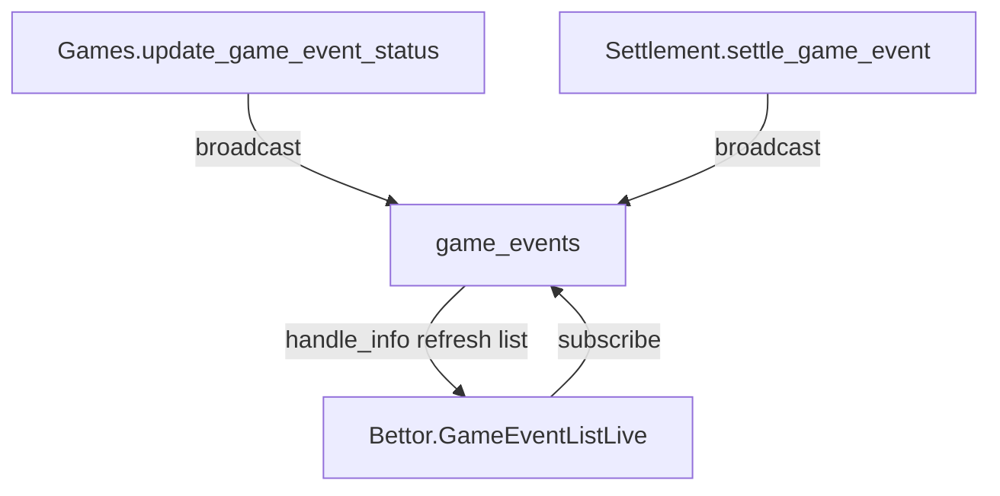

## Objetivo
- Que la lista de `/eventos` se actualice inmediatamente (sin esperar el refresh de 60s) cuando cambie el **status** de un evento (open/closed/finished/canceled).

## Cambios propuestos
### 1) Topic global de eventos
- Definir un topic PubSub global, por ejemplo `"game_events"`, para notificar cambios de status.

### 2) Emitir broadcasts cuando cambie el status
- En [`lib/bet_place/games.ex`](lib/bet_place/games.ex) `update_game_event_status/2`:
  - Después de `Repo.update()` exitoso, emitir:
    - `Phoenix.PubSub.broadcast(BetPlace.PubSub, "game_events", {:game_event_status_changed, event.id})`
- En [`lib/bet_place/betting/settlement.ex`](lib/bet_place/betting/settlement.ex):
  - Donde se marca un evento como `:finished` (ya emite `"game_event:<id>"`), añadir también broadcast a `"game_events"`.
  - Donde se cancela un evento (si aplica) añadir el mismo broadcast a `"game_events"`.

> Nota: settlement actualmente actualiza el status directamente con `GameEvent.status_changeset/2`, por eso necesitamos el broadcast adicional ahí (no pasa por `Games.update_game_event_status/2`).

### 3) Suscripción en la lista `/eventos`
- En [`lib/bet_place_web/live/bettor/game_event_list_live.ex`](lib/bet_place_web/live/bettor/game_event_list_live.ex):
  - En `mount/3`, si `connected?(socket)`:
    - `Phoenix.PubSub.subscribe(BetPlace.PubSub, "game_events")`
  - Implementar `handle_info({:game_event_status_changed, _id}, socket)` para:
    - `events = Games.list_open_game_events()`
    - `stream(socket, :events, events, reset: true)`

### 4) Validación
- `mix compile --warnings-as-errors`
- `mix test`
- Smoke test manual:
  - Abrir `/eventos` en una pestaña.
  - Cerrar/finalizar un evento en otra pestaña (admin/settlement).
  - Confirmar que el evento desaparece/actualiza su estado en la lista sin recargar.

