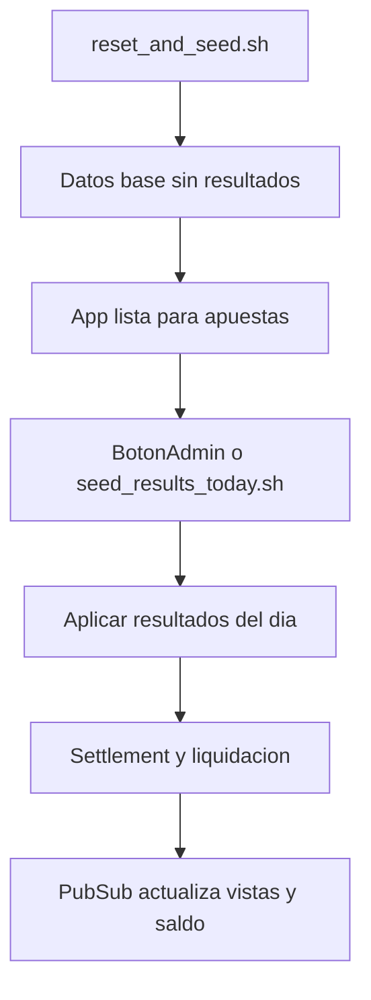

# Seeders curados + simulación de API

## Validación de tu idea

Sí, tiene sentido y es una buena estrategia para QA:

- Aísla pruebas de disponibilidad/latencia de la API real.
- Permite escenarios repetibles (mismos datos, mismos resultados esperados).
- Se alinea con tu flujo actual de settlement, porque la carga de resultados puede disparar liquidación igual que un sync.

## Alcance confirmado

- Fuente de datos curados: **base actual**.
- Usuarios semilla: 1 admin + 2 bettors.
- Clave común: `12345678`.
- Saldo inicial por usuario: `1000`.

## Estructura propuesta de seeders

Crear seeders separados bajo `priv/repo/seeds/`:

- `priv/repo/seeds/base_catalog.exs`
  - Game types/configs actuales + catálogo base de hipódromos/caballos/carreras (sin resultados).
- `priv/repo/seeds/users_and_finance.exs`
  - admin + 2 bettors con perfil completo.
  - métodos de pago (user/system) y saldo inicial.
- `priv/repo/seeds/results_today.exs`
  - aplica solo resultados para carreras cuya fecha coincide con `Date.utc_today()` al ejecutar.
  - tras aplicar resultados, invoca el flujo de settlement equivalente a sync.

Mantener `priv/repo/seeds.exs` como orquestador principal (sin resultados) para uso estándar.

## Curación desde DB actual

Agregar un extractor reproducible para construir dataset curado desde tu base real:

- `scripts/export_curated_seed_data.exs`
  - consulta carreras con resultados cargados,
  - serializa hipódromos/carreras/caballos/runners relevantes,
  - guarda snapshot versionado en:
    - `priv/repo/seeds/data/curated_racing_data.exs`
    - `priv/repo/seeds/data/curated_results_data.exs`

## Fecha de carreras al día de ejecución

En `base_catalog.exs`:

- remapear fechas/post_time de carreras curadas al día actual (`Date.utc_today()`), preservando orden y horas relativas.
- registrar mapa `race_external_id -> race_id` para que `results_today.exs` encuentre las carreras del día.

## Scripts operativos

Crear scripts ejecutables:

- `scripts/reset_and_seed.sh`
  - `mix ecto.reset`
  - ejecuta seeders base + users/finance
  - **no** ejecuta resultados.
- `scripts/seed_results_today.sh`
  - ejecuta exclusivamente `results_today.exs`
  - reporta cuántas carreras aplicaron resultados y cuántas liquidaciones corrieron.

## Botón en Admin para simular request de resultados

Sí, también tiene sentido para pruebas manuales.

- Extender `lib/bet_place_web/live/admin/dashboard_live.ex` con botón:
  - “Simular resultados (seed)”.
- Implementar servicio invocable:
  - `lib/bet_place/api/seed_result_simulator.ex`
  - mismo comportamiento que `seed_results_today.exs`.
- Publicar feedback por flash/PubSub para refresco de panel y vistas relacionadas.

## Flujo propuesto

## Validación

- Ejecutar `scripts/reset_and_seed.sh` y verificar:
  - 3 usuarios creados, perfiles completos, métodos de pago, saldo inicial.
  - carreras del día presentes sin posiciones.
- Ejecutar `scripts/seed_results_today.sh` o botón admin y verificar:
  - resultados aplicados a carreras del día,
  - liquidación de juegos (incluyendo VS) ejecutada,
  - cambios reflejados en saldo/historial.
- Correr `mix test` + `mix precommit` al final.
